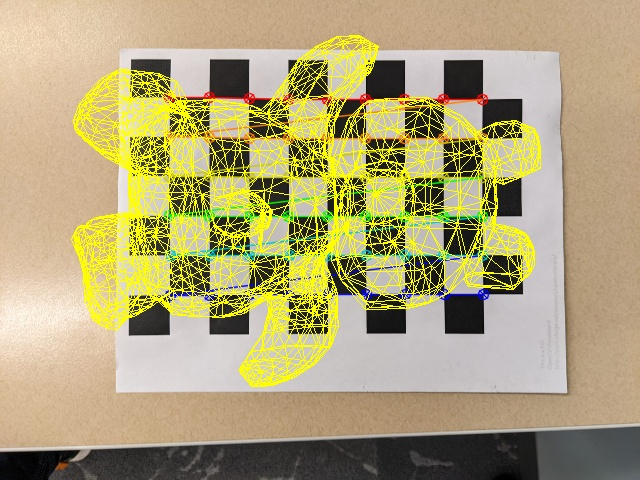
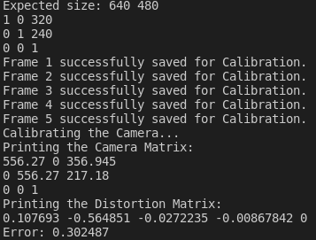

# Augmented Reality on a Printed Checkerboard

Real-time AR pipeline that calibrates a webcam, recovers the 6-DoF pose of a printed 9x6 chessboard each frame, and projects 3D wireframe content (coordinate axes, a triangular prism, or imported `.obj` meshes) onto the target. Built in C++ with OpenCV for Northeastern's CS 5330 (Pattern Recognition & Computer Vision).



## Why I built it

I wanted to feel, end to end, what it takes to make a virtual object "stick" to a real surface through a moving camera. That meant owning every stage of the pinhole pipeline myself instead of leaning on a library that hides the math:

- Camera intrinsics from scratch via Zhang's method on captured chessboard views.
- Per-frame extrinsics via `solvePnP` on the detected interior corners.
- Re-projection of arbitrary 3D geometry through `projectPoints` back into pixel space.

The same intrinsics + PnP loop is the spine of marker-based AR, surgical navigation, and most "first SLAM project" stacks, which is why I wanted it muscle-memory before moving on to VI-SLAM and feature-based methods.

## What it does

1. **Live calibration mode** (`vidDisplay.cpp`): opens the webcam, detects a 9x6 chessboard each frame, lets me press `s` to save corner sets, `c` to run `calibrateCamera`, and `w` to persist the resulting camera matrix and distortion coefficients to `calibration_data.csv`.
2. **Live AR mode** (`projection.cpp`): reads the saved intrinsics, runs `findChessboardCorners` + `cornerSubPix` + `solvePnP` every frame, and overlays one of:
   - `a`: RGB world-frame axes at the chessboard origin
   - `b`: a hard-coded triangular prism above the board
   - `c` / `d` / `e` / `f`: wireframe meshes parsed from `diamond.obj`, `teddybear.obj`, `skyscraper.obj`, or `spaceshuttle.obj`
3. **Single-image AR mode** (`insertVirtualObject.cpp`): same projection pipeline, but operates on one still image (`checkerboard2.jpeg`) and writes the composited frame to disk. Useful for sanity-checking the projection without juggling a video feed.
4. **Harris corner sandbox** (`harrisCorners.cpp`): a small standalone test of `cv::cornerHarris` used to compare feature responses against the chessboard corner detector during the writeup.

## Pipeline

```
                 +---------------------------+
   webcam  -->   |  cv::findChessboardCorners | --> 54 image points (9x6 interior corners)
                 |  cv::cornerSubPix          |
                 +-------------+-------------+
                               |
                               v
                 +---------------------------+
                 |  cv::solvePnP             |  intrinsics (K, dist) loaded once from CSV
                 |  (point_set <-> corners)  |  -->  rvec, tvec  (board pose in camera frame)
                 +-------------+-------------+
                               |
                               v
                 +---------------------------+
   .obj    -->   |  cv::projectPoints        | --> 2D image points
   mesh         |  drawObject (wireframe)   |
                 +-------------+-------------+
                               |
                               v
                       composited frame
```

Key choices:

- **Marker**: a printed 9x6 inner-corner chessboard. I picked chessboards over ArUco/AprilTag because the corner sub-pixel refinement is what made the projection stop jittering, and getting comfortable with `cornerSubPix` was part of the assignment goal.
- **Calibration**: Zhang's method via `cv::calibrateCamera` on >= 5 saved views, with `CALIB_FIX_ASPECT_RATIO + CALIB_FIX_K3`. Intrinsics + distortion are written to `calibration_data.csv` so the AR loop can start instantly without re-calibrating.
- **Pose**: `cv::solvePnP` each frame against the same world point set (each square = 1 unit). No tracking-across-frames or Kalman smoothing; every frame is independent, which keeps the code honest about how good the per-frame PnP is.
- **Rendering**: pure wireframe via `cv::line` over projected vertex indices. Solid-shaded rendering with a depth buffer was out of scope for a 1-week sprint; the wireframe path was enough to evaluate pose stability.

## Results

Calibrated on five views with the same Mac webcam:

```
Camera matrix K:
  556.27    0     356.945
    0     556.27  217.18
    0       0       1

Distortion (k1, k2, p1, p2, k3):
  0.1077  -0.5649  -0.0272  -0.0087   0

Re-projection error: 0.302 px
```

A re-projection error of ~0.3 pixels was comfortably below the assignment target and the AR overlay stayed locked to the board through normal hand-held motion. With sustained shake or near-grazing angles the wireframe would flicker, which is what motivated me to look at filtered pose estimators in follow-up coursework.



## Tech

- **Language**: C++17
- **Library**: OpenCV 4 (`calib3d`, `imgproc`, `highgui`)
- **Inputs**: a printed 9x6 chessboard, any USB/laptop webcam, Wavefront `.obj` meshes
- **OS**: developed on macOS, portable to any platform with OpenCV

## Quickstart

```bash
# 1. Build calibration tool
cd "Project Files"
g++ -std=c++17 vidDisplay.cpp -o vidDisplay $(pkg-config --cflags --libs opencv4)

# 2. Capture frames + calibrate + write CSV
./vidDisplay
# Live keys:
#   s -> save a chessboard frame (need >= 5)
#   c -> run calibrateCamera
#   w -> write camera matrix + dist coeffs to calibration_data.csv
#   q -> quit

# 3. Build the AR projector
g++ -std=c++17 projection.cpp -o projection $(pkg-config --cflags --libs opencv4)

# 4. Run live AR (needs calibration_data.csv in cwd)
./projection
# Live keys:
#   a -> axes      b -> prism
#   c -> diamond   d -> teddybear
#   e -> skyscraper f -> space shuttle
#   q -> quit

# 5. Or run on a single still
g++ -std=c++17 insertVirtualObject.cpp -o insertVirtualObject $(pkg-config --cflags --libs opencv4)
./insertVirtualObject   # uses checkerboard2.jpeg, writes Virtual Object Inserted.jpg
```

A pre-computed `calibration_data.csv` (my Mac webcam) is checked in so the AR demo runs without re-calibrating.

## Repo layout

```
Project Files/
  vidDisplay.cpp            # Capture frames + run calibrateCamera + persist intrinsics
  projection.cpp            # Live AR loop (solvePnP every frame, hot-swap meshes by keypress)
  insertVirtualObject.cpp   # Same pipeline against a single still image
  harrisCorners.cpp         # Harris corner sandbox used during the writeup
  calibration.cpp / .hpp    # Shared helpers (read/write CSV, OBJ parser, axis/prism drawers)
  calibration_data.csv      # Persisted K + distortion from the Mac webcam
  *.obj                     # diamond, teddybear, skyscraper, spaceshuttle meshes
  checkerboard2.jpeg        # Test image for insertVirtualObject
  Calibration/, Axes/, Object/   # Captured calibration views + result screenshots
Augmented Reality Project Report.pdf   # Full write-up submitted for the course
```

## Limitations & what I'd change next

- **No depth buffer / occlusion**: wireframe-only rendering. The next pass would add a z-buffer and shaded triangles so meshes look solid against the board.
- **No temporal smoothing**: every frame's pose is independent. A simple low-pass filter or Kalman over `rvec`, `tvec` would kill the residual jitter on still hands.
- **Chessboard-only**: a single planar marker. Swapping `findChessboardCorners` for ArUco/AprilTag would let me handle multiple markers per scene and support occlusion of part of the board.
- **No mobile build**: desktop C++ binary. Porting the same loop to ARKit/ARCore or OpenCV-Android would be the natural next milestone.

## License

MIT. See [LICENSE](LICENSE).

## Author

I am Dhruvil Parikh (MS Robotics, Northeastern University; BTech ECE, NIT Surat). Portfolio: [dparikh79.github.io](https://dparikh79.github.io).
